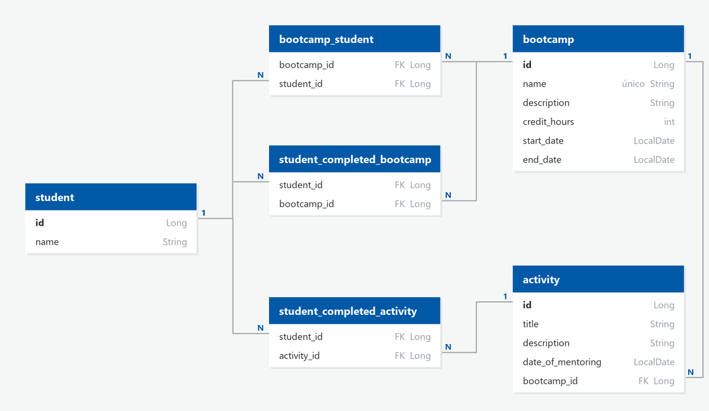

# Bootcamp

API REST em Java 21 e Spring Boot 4 para gerenciar bootcamps, matricular alunos, cadastrar as atividades de cada bootcamp e dar XP ao aluno por atividade concluída e por bootcamp finalizado.

Fiz a primeira versão em 2024, com o cadastro de bootcamps e o modelo do banco. Em 2026 voltei ao projeto para corrigir bugs, atualizar o Spring Boot e completar o que faltava: alunos, matrícula, atividades e XP.

## Como rodar

Precisa do JDK 21 e de um PostgreSQL com um banco chamado `bootcamp`. As tabelas são criadas pelo Hibernate na primeira execução.

Com Docker, o `compose.yaml` sobe o PostgreSQL 16 já com o banco:

```bash
docker compose up -d
```

Depois, a API:

```bash
./mvnw spring-boot:run
```

No Windows, use `mvnw.cmd`. A API sobe em `http://localhost:8080`.

A conexão com o banco vem de variáveis de ambiente, com padrão para rodar localmente:

| Variável | Padrão |
|---|---|
| `DB_URL` | `jdbc:postgresql://localhost:5432/bootcamp` |
| `DB_USERNAME` | `postgres` |
| `DB_PASSWORD` | `postgres` |

A documentação fica no Swagger, em `http://localhost:8080/swagger-ui.html`, e o JSON do OpenAPI em `/v3/api-docs`.

Os testes rodam com `./mvnw test` e não precisam do PostgreSQL: usam um H2 em memória.

## Endpoints

| Método | Rota | O que faz |
|---|---|---|
| `GET` | `/bootcamps` | Lista os bootcamps |
| `GET` | `/bootcamps/{id}` | Busca um bootcamp |
| `POST` | `/bootcamps` | Cria um bootcamp com `name`, `description`, `creditHours`, `startDate` e `endDate` |
| `PUT` | `/bootcamps/{id}` | Edita um bootcamp |
| `DELETE` | `/bootcamps/{id}` | Exclui um bootcamp sem alunos nem atividades |
| `GET` | `/bootcamps/{id}/students` | Lista os alunos matriculados |
| `POST` | `/bootcamps/{id}/students/{studentId}` | Matricula o aluno |
| `DELETE` | `/bootcamps/{id}/students/{studentId}` | Cancela a matrícula |
| `GET` | `/bootcamps/{bootcampId}/activities` | Lista as atividades do bootcamp |
| `GET` | `/bootcamps/{bootcampId}/activities/{id}` | Busca uma atividade |
| `POST` | `/bootcamps/{bootcampId}/activities` | Cria uma atividade com `title`, `description` e `dateOfMentoring` |
| `PUT` | `/bootcamps/{bootcampId}/activities/{id}` | Edita uma atividade |
| `DELETE` | `/bootcamps/{bootcampId}/activities/{id}` | Exclui uma atividade que ninguém concluiu |
| `GET` | `/students` | Lista os alunos com o XP de cada um |
| `GET` | `/students/{id}` | Busca um aluno |
| `POST` | `/students` | Cria um aluno com `name` |
| `PUT` | `/students/{id}` | Edita um aluno |
| `DELETE` | `/students/{id}` | Exclui o aluno, as matrículas e as conclusões dele |
| `GET` | `/students/{id}/completed-activities` | Lista as atividades que o aluno concluiu |
| `POST` | `/students/{id}/completed-activities/{activityId}` | Marca a atividade como concluída |
| `GET` | `/students/{id}/completed-bootcamps` | Lista os bootcamps que o aluno finalizou |

## Regras

- O nome do bootcamp é único. Nome, carga horária maior que zero, data de início e data de término são obrigatórios, e o término não pode ser anterior ao início.
- Aluno precisa de nome. Atividade precisa de título e data da mentoria.
- Um aluno pode estar em vários bootcamps. Cada atividade pertence a um bootcamp só e só é encontrada pela rota dele.
- O aluno só conclui atividade de bootcamp em que está matriculado, e cada atividade uma vez. Cada atividade vale 35 de XP.
- Ao concluir todas as atividades de um bootcamp, o aluno finaliza o bootcamp e ganha 15 x a carga horária em XP: 600 num bootcamp de 40 h.
- Bootcamp com alunos ou atividades não pode ser excluído, nem atividade que algum aluno já concluiu.
- O `id` enviado no corpo é ignorado: `POST` sempre cria um registro novo.
- Dado inválido volta com 400, registro inexistente com 404 e conflito de regra com 409, no formato Problem Details (RFC 9457).

Aluno depois de concluir as duas atividades de um bootcamp de 40 h (2 x 35 + 600):

```json
{
  "id": 1,
  "name": "Ana",
  "xp": 670.0
}
```

Cadastro com dados inválidos:

```json
{
  "detail": "Dados inválidos",
  "instance": "/bootcamps",
  "status": 400,
  "title": "Bad Request",
  "errors": {
    "creditHours": "A carga horária deve ser maior que zero",
    "endDateAfterStartDate": "A data de término não pode ser anterior à de início",
    "name": "O nome é obrigatório"
  }
}
```

## Como o código funciona

```
src/main/java/com/bootcamp/bootcampbackend/
├── controllers/     # BootcampController, StudentController e ActivityController, só recebem e repassam
├── services/        # BootcampService, StudentService e ActivityService, com as regras
├── repositories/    # Spring Data JPA
├── entities/        # Bootcamp, Student e Activity, com as validações dos campos
└── exceptions/      # NotFoundException, ConflictException e ApiExceptionHandler
src/test/java/com/bootcamp/bootcampbackend/
├── controllers/     # testes da API com MockMvc, um arquivo por recurso
└── *Test.java       # subida da aplicação, tabelas do banco e Swagger
```

- **Regras nos services.** Nome repetido, matrícula, conclusão de atividade e bloqueio de exclusão ficam nos services, que lançam `NotFoundException` ou `ConflictException`.
- **Erros centralizados.** O `ApiExceptionHandler` transforma essas exceções em 404 e 409, e a validação dos campos em 400 com a lista de `errors`.
- **XP calculado, não guardado.** `Student.getXp` soma o `xpCalculate` das atividades concluídas e dos bootcamps finalizados. Não existe coluna de XP para manter sincronizada.
- **Banco gerado pelo JPA.** Como na versão de 2024, o Hibernate cria e atualiza as tabelas a partir das entidades (`ddl-auto=update`).

<p align="center">
  
</p>

## Revisitando o projeto em 2026

Uma análise nova mostrou que a versão de 2024 não conseguia gravar nenhum bootcamp: as entidades eram `record`, que o JPA não aceita. Por trás desse erro havia outros, que só apareceram depois dele corrigido.

### Bugs corrigidos

| Bug | Causa | Correção |
|---|---|---|
| Todo `POST` dava erro 500 | Entidades declaradas como `record`: o JPA exige classe não final com construtor sem argumentos | `Bootcamp`, `Student` e `Activity` viraram classes |
| A listagem dava erro 500 com qualquer bootcamp cadastrado | As listas de alunos e atividades eram carregadas sob demanda, e o JSON era montado fora da sessão do banco | O bootcamp devolve só os próprios dados; alunos e atividades têm rotas próprias |
| Reiniciar a API apagava todos os dados | `hibernate.hbm2ddl.auto=create-drop` sobrescrevia o `ddl-auto=update` | Removido o `create-drop` |
| O segundo bootcamp cadastrado dava erro de chave duplicada | Id sem `@GeneratedValue`: todo registro sem id era gravado com id 0 | Ids gerados pelo banco |
| O aluno não conseguia entrar em um segundo bootcamp, e as relações eram gravadas duas vezes | `@OneToMany` sem `mappedBy` criava tabelas de junção com restrição única, além da coluna do `@ManyToOne` | Aluno x bootcamp em N:N pela `bootcamp_student`; atividade x bootcamp em 1:N pela coluna `bootcamp_id` |

### Decisões técnicas

**Aluno em vários bootcamps, atividade em um só**

O diagrama que desenhei em 2024 no [QuickDBD](https://app.quickdatabasediagrams.com/) já tinha uma tabela de junção entre aluno e bootcamp, mas o código gravava a relação como 1:N. Segui o diagrama para o aluno, que pode fazer mais de um bootcamp. A atividade ficou em 1:N, porque é uma mentoria com data, criada dentro de um bootcamp.

**XP por atividade concluída e por bootcamp finalizado**

O XP do aluno vem do que ele concluiu, não do que existe no bootcamp:

- Só conta atividade de bootcamp em que o aluno está matriculado.
- Finalizar o bootcamp vale 15 x a carga horária, o mesmo XP padrão da atividade. Assim, um bootcamp maior vale mais, e finalizar vale bem mais que uma atividade solta.
- A finalização fica gravada no momento da última atividade. Se o bootcamp ganhar uma atividade nova depois, quem já finalizou não perde o bônus.
- Cancelar a matrícula não apaga as conclusões nem o XP já ganho.
- As atividades e os bootcamps concluídos são carregados junto com o aluno para o XP sair na mesma resposta. O custo é uma consulta extra por aluno na listagem.

**Exclusão bloqueada em vez de cascata**

Excluir um bootcamp com alunos ou atividades responde 409 em vez de apagar tudo junto. Assim, uma exclusão por engano não leva matrículas e histórico de XP. Pelo mesmo motivo, atividade concluída por algum aluno não pode ser excluída.

**Testes com H2 em memória**

Os testes sobem a aplicação inteira e chamam a API pelo MockMvc, sem precisar de PostgreSQL:

- O perfil `test` troca só o banco. O resto vem do `application.properties` real, e foi assim que um teste provou o `create-drop`.
- Cada contexto de teste ganha um banco próprio, para os dados de um teste não aparecerem no outro.
- O custo é não testar o PostgreSQL de verdade: o H2 roda em modo de compatibilidade com o PostgreSQL, mas não é o mesmo banco.

**Configuração por variável de ambiente**

A senha do banco estava fixa no `application.properties`. Agora URL, usuário e senha vêm de `DB_URL`, `DB_USERNAME` e `DB_PASSWORD`, com padrão local para não atrapalhar quem só quer rodar. O `compose.yaml` substituiu o script que criava o banco.

**Spring Boot 4.1**

A versão de 2024 usava o Spring Boot 3.3, sem suporte desde 2025. Na atualização, o `spring-boot-starter-web` virou `spring-boot-starter-webmvc`, o nome novo no Boot 4.
