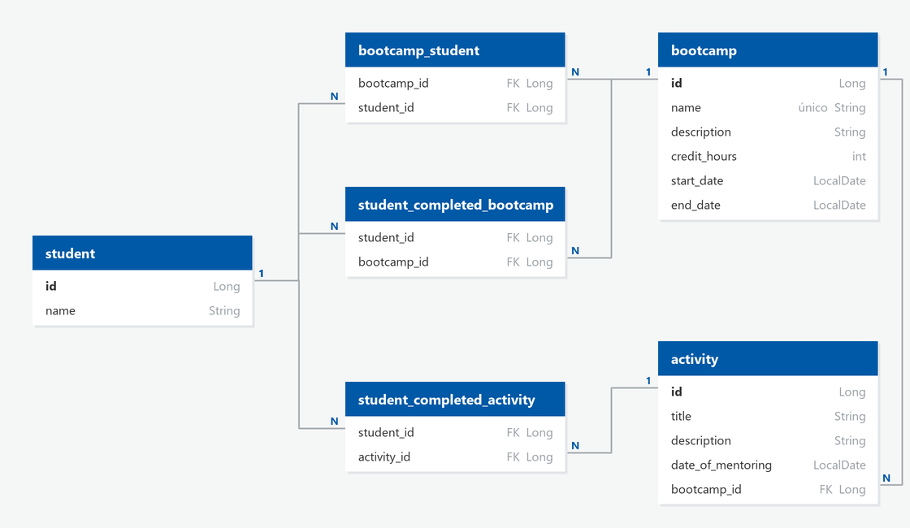

# 🎓 Bootcamp

<div align="center">
  
  
  
  
  
</div>

<br>

> 🎯 **API REST em Java 21 e Spring Boot 4 para gerenciar bootcamps**, matricular alunos, cadastrar as atividades de cada bootcamp e dar XP ao aluno por atividade concluída e por bootcamp finalizado.

Fiz a primeira versão em 2024, com o cadastro de bootcamps e o modelo do banco. Em 2026 voltei ao projeto e descobri que ele não conseguia gravar nenhum bootcamp. Corrigi os bugs, atualizei o Spring Boot e completei o que faltava: alunos, matrícula, atividades e XP.

<p align="center">
  
</p>

## 📋 Índice

- [🎓 O que aprendi](#-o-que-aprendi)
- [🚀 Como rodar](#-como-rodar)
- [🧠 Decisões técnicas](#-decisões-técnicas)
- [🔄 Revisitando o projeto em 2026](#-revisitando-o-projeto-em-2026)
- [📄 Licença](#-licença)

## 🎓 O que aprendi

- **O JPA tem exigências que o compilador não mostra.** As entidades eram `record`, e todo `POST` dava erro 500: o JPA precisa de classe não final com construtor sem argumentos.
- **Um bug esconde outros.** Só depois de corrigir as entidades apareceram o `create-drop` que apagava os dados a cada reinício, o id sempre 0 e as relações gravadas duas vezes.
- **Carregar relação do banco tem custo, para os dois lados.** Carregada sob demanda fora da sessão, a lista de alunos derrubava a listagem; carregada sempre, listar 20 alunos fazia 41 consultas. Sob demanda e em lote, são 3.
- **Dado derivado não precisa de coluna.** O XP é calculado a partir do que o aluno concluiu, pela `ExperiencePolicy`, e não existe valor guardado para ficar fora de sincronia.
- **Teste que usa a configuração real acha bug de configuração.** O perfil de teste troca só o banco, e foi um teste que provou o `create-drop`.
- **Refatorar com prova.** Gravei as respostas de 71 chamadas antes de reorganizar o código e comparei depois de cada commit: o conteúdo ficou idêntico.

## 🚀 Como rodar

Precisa do JDK 21 e do Docker. O `compose.yaml` sobe o PostgreSQL 16 com o banco `bootcamp`, e o Hibernate cria as tabelas.

```bash
docker compose up -d     # PostgreSQL
./mvnw spring-boot:run   # API em http://localhost:8080 (no Windows, mvnw.cmd)
```

| Recurso | Rotas |
|---|---|
| Bootcamps | `GET`, `POST`, `PUT` e `DELETE` em `/bootcamps` |
| Matrícula | `GET /bootcamps/{id}/students`, `POST` e `DELETE /bootcamps/{id}/students/{studentId}` |
| Atividades | `GET`, `POST`, `PUT` e `DELETE` em `/bootcamps/{bootcampId}/activities` |
| Alunos | `GET`, `POST`, `PUT` e `DELETE` em `/students`, com o XP de cada um |
| Conclusão | `POST /students/{id}/completed-activities/{activityId}`, `GET /students/{id}/completed-activities` e `/completed-bootcamps` |

A documentação fica no Swagger, em `http://localhost:8080/swagger-ui.html`. Cada atividade vale 35 de XP, e finalizar um bootcamp vale 15 x a carga horária. Os testes rodam com `./mvnw test`, sem PostgreSQL.

## 🧠 Decisões técnicas

| Decisão | Alternativa | Por quê |
|---|---|---|
| Aluno em vários bootcamps (N:N), atividade em um só (1:N) | Tudo em 1:N, como o código de 2024 | Segue o diagrama que desenhei no [QuickDBD](https://app.quickdatabasediagrams.com/); a atividade é uma mentoria criada dentro do bootcamp |
| XP calculado pela `ExperiencePolicy` | Coluna de XP no aluno | Não há valor para manter sincronizado |
| Excluir com dependentes responde 409 | Exclusão em cascata | Uma exclusão por engano não leva matrículas e histórico de XP |
| H2 em memória nos testes | PostgreSQL real | Os testes rodam sem banco instalado; o custo é o H2 não ser o mesmo banco |
| Um service por caso de uso (`EnrollmentService`, `CompletionService`) | Services que usam os repositórios uns dos outros | Cada regra num lugar só, sem dependência cruzada |
| Constantes com nome na regra de XP | Uma Strategy por tipo de XP | Para duas regras de uma linha, seria estrutura antes da hora |

## 🔄 Revisitando o projeto em 2026

Uma análise nova mostrou que a versão de 2024 não gravava nada, e por trás desse erro havia outros:

| O que estava errado | O que mudou |
|---|---|
| Todo `POST` dava erro 500, com as entidades como `record` | `Bootcamp`, `Student` e `Activity` viraram classes |
| Reiniciar a API apagava todos os dados | Saiu o `hibernate.hbm2ddl.auto=create-drop` |
| O segundo bootcamp dava chave duplicada, com o id sempre 0 | Ids gerados pelo banco |
| O aluno não entrava num segundo bootcamp | `@OneToMany` sem `mappedBy` trocado pela N:N na `bootcamp_student` |
| A listagem dava 500 com qualquer bootcamp cadastrado | Alunos e atividades ganharam rotas próprias, e o bootcamp devolve só os próprios dados |

## 📄 Licença

[MIT](LICENSE)

---

<div align="center">
  <p>Desenvolvido por <strong>Luiz Matos</strong></p>
  <p>
    <a href="https://github.com/luiz-matos">GitHub</a> •
    <a href="https://www.linkedin.com/in/luizeduardomatos/">LinkedIn</a>
  </p>
</div>
